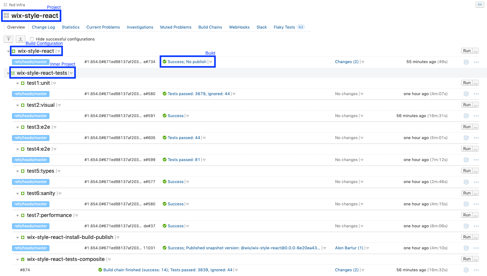
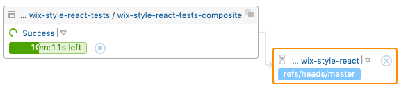
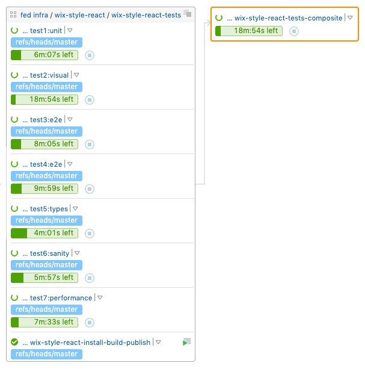

# Continuous Integration and Delivery

In general, _Continuous Integration_ is a practice of regularly integrating code changes into a code repository, in a way that these changes trigger a build which asserts that nothing is broken.
This process allows multiple developers to merge their commits into a shared repository simultaneously.

The next phase, assuming all of the build steps finish successfully, is releasing to production. That practice is applied manually and called _Continuous Delivery_.

This article describes the flow process (which implements the concepts above) starting the moment we merge a commit into master, by the time the package is published to npm and Storybook files are deployed.

## Terminology

Before we start, we better recognize the following TeamCity terms:

- Build Step - a task to be executed (for instance, `npm run build`)
- Build - a process that executes list of build steps
- Build Chain - a process that refers to several build processes as a single pipeline
- Build Configuration - a collection of settings that define the build process (which means, build is the actual instance of these configurations)
- Composite Build Configuration - a type of build configuration that aggregates results from several build processes, which could be executed in parallel
- Project - a collection of build configurations (a project could be contained inside another project)

  

## Integrating TeamCity with WSR

As we apparently know, Wix owns multiple TeamCity servers. Two of them are being used by WSR, and that's actually why we have two different TeamCity projects:

- [`wix-style-react`](http://tc.dev.wixpress.com/project.html?projectId=Wix_Angular_WixStyleReact&branch_Wix_Angular_WixStyleReact=__all_branches__) - the main project that's associated with the master branch
- [`FedInfra WixStyleReac WixStyleReactNew Parallel`](http://pullrequest-tc.dev.wixpress.com/project.html?projectId=FedInfra_WixStyleReac_WixStyleReactNew_Parallel&branch_FedInfra_WixStyleReac_WixStyleReactNew_Parallel=4401%2Fmerge) - a project that's associated with the other branches and triggered when creating a pull request

Also, there are a few differences between them, which we'll mention during the article, however both consists of pretty much the same build configurations.

The entry **build configuration**, that actually triggers everything, is called [`wix-style-react`](http://tc.dev.wixpress.com/viewType.html?buildTypeId=CommonComponent_WixStyleReact) (what a surprise 😉).
Notice that we differentiate between the TeamCity project (which has an identical name) and the build configuration. Builds of this configuration are started and associated with new commits of the relevant branch.

Anyway, this build configuration depends on another **composite** build configuration - which is [`wix-style-react-tests-composite`](http://tc.dev.wixpress.com/viewType.html?buildTypeId=Wix_Angular_WixStyleReact_WixStyleReactTests_WixStyleReactTestsComposite). In case you're curious, the dependency is applied when triggering new entry build and defined by the following rules:

- If the latest composite build success, the entry build would use this build instead of triggering a new (composite) build
- If the latest composite build fails (broken test/fails to start/aborted), the entry build would fail

Here's a diagram that demonstrates the dependency:

  

The next thing we're going to do is getting into the `wix-style-react-tests-composite`.

## The Composite Build

Well, we already said that the composite build configuration is typically triggered by `wix-style-react`. The point is, this build configuration depends on several other build configurations itself.

Let's categorize them:

- Testing - these configurations are responsible to run build steps that ensure there are no issues in various aspects (unit, visual, e2e, performance, etc.). For example, `test1:unit`.
- Promotion - these configurations are responsible to run build steps that actually build and publish artifacts (package, docs, etc.). For example, `wix-style-react-install-build-publish`.

In practice, the dependency diagram of the main TeamCity project is the following:

  

Notice that the major benefit of the composite build configuration is executing **parallel** builds. This also means that the promotion might finish before the tests (however, it doesn't mean the artifacts are actually published). Don't worry - we'll describe later how the promotion guarantees it's the right time to publish and what the benefit at all from executing that in parallel.

Either way, the entry build configuration (and other configurations as well) is consist of the `Run npmBuild` build step which basically executes a file called [`npmBuildWrapper.sh`](https://github.com/wix-private/wix-fed-scripts/blob/master/src/npmBuildWrapper/npmBuildWrapper.sh). This file manages and operates stuff that related to npm, including executing npm scripts.

Moreover, that file uses [`.ci_config`](https://github.com/wix/wix-style-react/blob/master/.ci_config) to convert npm scripts ("batches") into build configurations - which are registered automatically as dependencies of the composite build configuration. Put it simply, any npm script that appears inside `batches`, would be executed in parallel as part of the composite build. That's exactly the way we register our testing configurations.

Now that we understand the responsibilities of the composite build configuration and the connection to `npmBuildWrapper.sh`, we can elaborate the promotion process in detail.

## The Promotion Process

As we mentioned before, the promotion process is what builds and guarantees our artifacts are published at the right time. Also, we mentioned that each build configuration in our TeamCity projects executes `npmBuildWrapper.sh` under the hood.

Internally, `npmBuildWrapper.sh` uses variety of arguments to trigger conditionally scripts such as nvm, npm, fedops-api and more.

The argument which relevant for the promotion process called `PUBLISH_ARG` and accepts the following values:

- `no-publish` - indicates to install, build and test (without publishing obviously)
- `publish` - indicates to publish immediately
- `temp-publish` - indicates to publish a temporary version of the package, while executing the composite dependencies in parallel, which would be taken later (assuming all tests pass successfully)
- `re-publish` - indicates that all composite tests passed successfully and the temporary package is ready to be published with a real version

So, `npmBuildWrapper.sh` mainly uses `PUBLISH_ARG` (and additional arguments, to be honest) to manage the artifact state and decide when it's the time to install, build, test or publish.

Well, we can combine at the moment the stuff we covered thus far in order to simulate a full process until the promotion is done.

### Step 1 - Creating a PR

The first thing we usually do, is creating a pull request for some changes from any branch into master. Then, a new build is added to the entry build configuration (`wix-style-react` within the `FedInfra WixStyleReac WixStyleReactNew Parallel` project.

This build triggers the appropriate composite build, which executes the tests and promotion builds in parallel.
Each test build is initialized with `PUBLISH_ARG` that takes `no-publish`. Although, the promotion build is initialized with the same `PUBLISH_ARG` value (merely to install and build the package), however it changes to `temp-publish` afterward.

In this way, while the tests are executed - a package with a temporary version is published into npm. Just to clarify, the version is defined like `0.0.0-ce1b410bc1328c72df5d75d672335a37`.

Clearly, once the composite build finishes successfully, the entry build would pass as well.

_**Note:** The temporary package is a feature that allows us to examine our changes and actually use them unofficially in other projects._

### Step 2 -
